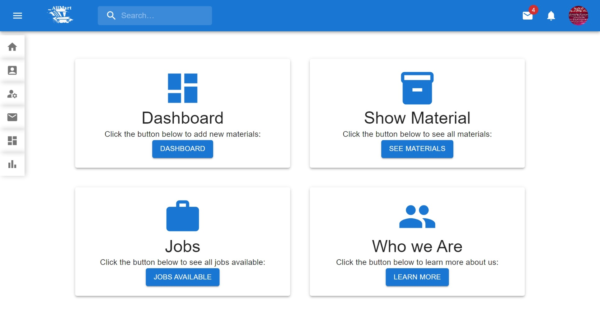
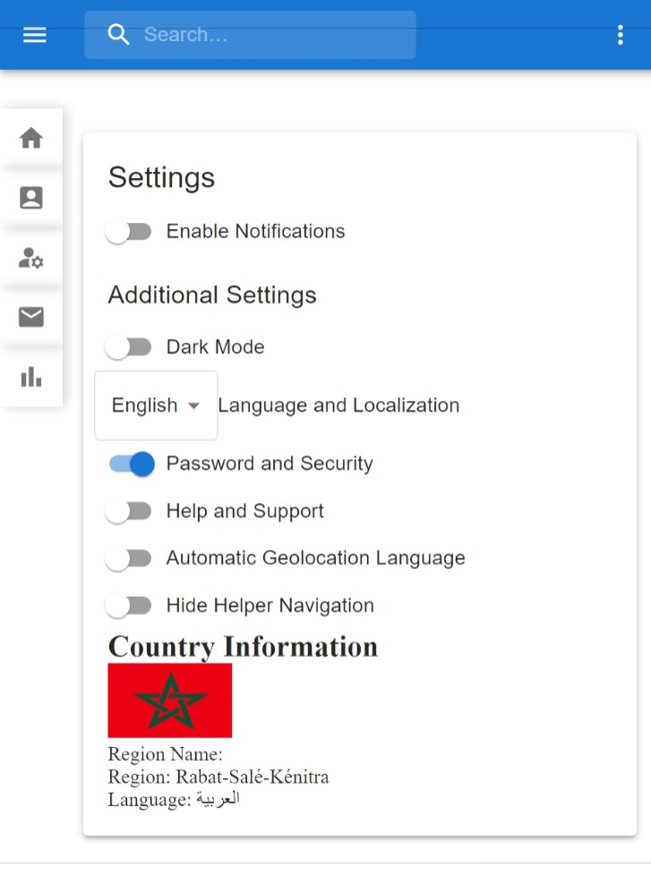

# CRUD Worker Management and Marketing

## Project Overview
This project provides a CRUD worker management system with a strong emphasis on marketing to B2B targets.

## Features

### Task Management

- **Admin Task Creation:** Administrators have the ability to create tasks easily through the admin interface. They can specify task details, assign tasks to specific workers, set due dates, and include relevant information.

- **Worker Task Access:** Workers can conveniently access their assigned tasks through their profiles. This provides them with a clear list of tasks they need to complete, along with associated details and deadlines.

- **Task Status Updates:** Workers can update the status of tasks to indicate when a task is in progress, completed, or any other relevant status. This feature simplifies task management and progress tracking.

- **Task Completion:** Workers can mark tasks as "done" when they finish the assigned work. This status change triggers the update in the task's progress.

- **Progress Tracking:** Admins or bosses can easily track the progress of tasks assigned to workers. They can view the status of each task and ensure that work is on track to meet deadlines.

This feature streamlines the task management process, making it more efficient for both administrators and workers. It enhances transparency and accountability in task assignment and completion.

## Technologies Used

### Frontend
- **React:** A JavaScript library for building user interfaces.
- **Material-UI:** A popular React UI framework.
- **Emotion:** A library for writing CSS styles with JavaScript.
- **Axios:** A promise-based HTTP client for making network requests.
- **Formik:** A library for building forms in React.
- **Chart.js:** A JavaScript charting library for data visualization.
- **React-Router-DOM:** A library for handling routing in React applications.
- **Redux:** A state management library for React applications.
- **i18next:** An internationalization framework for web applications.
- ... (and more)

### Backend
- **Express:** A web application framework for Node.js.
- **Mongoose:** An ODM (Object Data Modeling) library for MongoDB.
- **SendGrid:** A service for sending transactional and marketing emails.
- **Stripe:** A payment processing platform.
- **Firebase Admin SDK:** A set of tools for managing Firebase from the server.
- **Cloudinary:** A cloud-based image and video management service.
- **JWT (JSON Web Tokens):** A standard for creating access tokens.
- **Multer:** Middleware for handling file uploads.
- **Nodemailer:** A module for sending emails with Node.js.
- ... (and more)

## Getting Started
- Prerequisites
- Installation
- Configuration

## Usage
How to use the CRUD worker management system.

## Marketing Plan
- Identifying Potential Clients
- Customization and Demo
- Features and Benefits
- Supporting Companies
- Join the Marketing Team

## Contact Information
For more information, you can contact me on [LinkedIn](https://www.linkedin.com/in/younes-raymond-188a40241/).

## Earnings and Incentives
- Commission Structure

## Our Plan
- Pricing and Key Offerings

## License
This project is licensed under the [License Name] License.

## Contributing
Contribution guidelines.

## Acknowledgments
Mention any acknowledgments.

